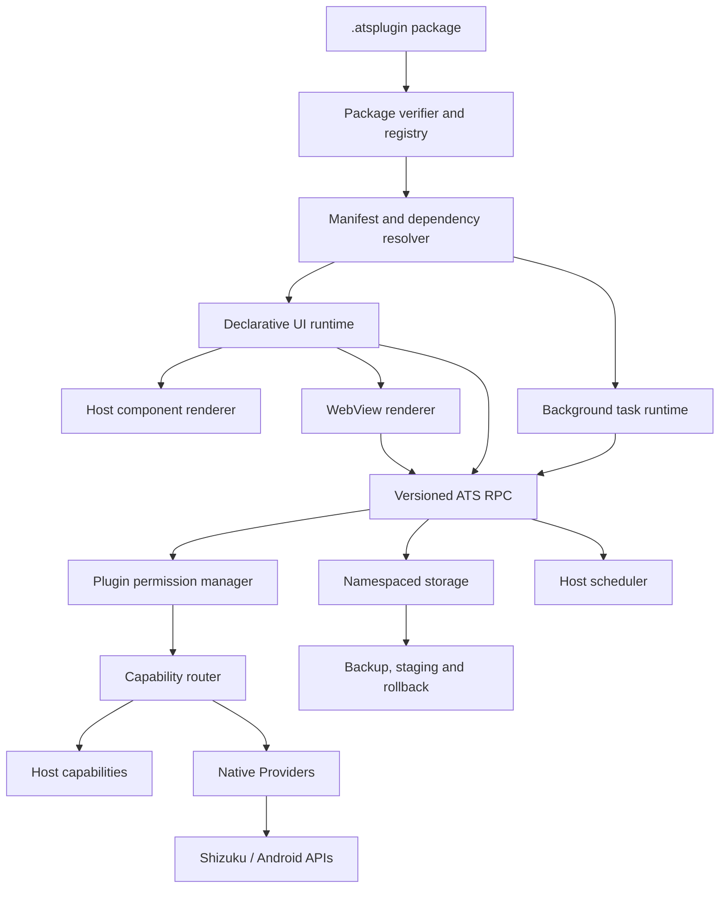

# Android Tool Suite 插件运行时架构规范

适用范围：Android 宿主；跨平台扩展须遵循公共契约与平台 Adapter 边界。

## 1. 决策摘要

Android Tool Suite（ATS）的长期定位是：

> Android 上的单应用个人工具平台。所有工具使用统一声明式 UI；简单页面选择宿主组件树 renderer，复杂页面选择隔离 WebView renderer。普通插件只能通过用户可管理的 ATS Capability API 使用数据、后台任务和 Android 系统能力；需要直接接触平台 API 的插件升级为签名、全信任的 `trusted-provider`，但仍可拥有 UI、Tool、主页组件和 Worker。

运行时不采用“Host APK + 通用 Sandbox APK + 远程 Compose/Surface”的双应用架构。普通插件的界面和后台执行通过宿主管理的 renderer 与 Worker Backend 分离。

插件采用两类开发模型：

1. ATS Tool：统一 `ui/*.json` 入口；受限组件树由 Host 渲染，或由 `webview` 根节点选择静态 Web UI renderer，可按需增加薄 JS SDK／WASM。
2. Trusted Provider：使用 Kotlin/Android 实现需要宿主身份的平台能力，启用即表示完全信任；它仍可贡献普通插件功能。Shizuku 只在宿主保留 Android 安装模型要求的最小 bootstrap。

WASM 是可选能力，不是普通插件的入门门槛。Android 运行时的清单、RPC、数据和任务接口不得暴露 `Activity`、`Context`、`Intent`、Binder 等 Android 类型，以便未来在不重写插件协议的前提下增加其他平台实现。

AI 插件开发与 ATS 发布平台不属于本架构的实施阶段：它们分别维护在 [ai-plugin-development.md](../plans/ai-plugin-development.md) 和 [publication-platform.md](../plans/publication-platform.md)，优先级均低于插件运行时。总体排序见 [roadmap.md](../plans/roadmap.md)。

## 2. 设计目标与非目标

### 2.1 目标

- 普通插件开发退化为标准 Web 开发，加一个清单即可形成最小插件。
- 插件只学习少量稳定的 ATS API，不学习宿主 Android 生命周期和 Compose 组件树。
- UI 入口与后台入口分离；后台任务由宿主调度，不依赖常驻 WebView 或 `setInterval()`。
- 任何普通插件都可用受限 Worker 实现版本化 Capability；只有必须以宿主身份与 Android/Shizuku 交互的实现使用全信任底层 Provider。
- 用户可以逐插件允许或撤销敏感 Capability；scope 扩大后必须重新决定，事件和后台任务使用同一权限状态。
- Shizuku 能力实现和授权 UI 都不使用已退出的 API1 `ToolPlugin`：同一个签名 `trusted-provider` 包提供授权 UI、主页组件与底层能力。
- 插件数据按命名空间管理，支持备份、校验、迁移、回滚与未来运行时替换。
- 保持用户只安装和打开一个 ATS App；Provider 和工具的安装细节不扩散到桌面体验。
- 保留现有签名索引、Debug/Release 渠道、依赖、升级/降级和数据兼容治理。

### 2.2 非目标

- 非 Android 宿主属于独立规划，不作为 Android 运行时的交付条件。
- 不承诺“任意语言天然可用”；准确边界是能产出 Web 资源，或能编译到 ATS 支持的 WASM ABI。
- 不把声明式 UI 扩张成任意表达式或脚本框架；复杂交互直接使用 Web 平台。
- 普通插件不得携带原生载荷；原生 Provider 必须遵守签名和完全信任规则。
- 不向普通插件提供裸 `runShellCommand()`、Binder 句柄或任意文件路径。
- 不将协议权限检查描述为操作系统级强隔离；不同 Backend 的隔离保证必须分别说明。
- 数据恢复只面向宿主管理的 format v3 Dataset；历史 API1 Bridge 与双向同步路径均已退出。
- 不把 Developer Agent、AI Provider、发布社区或自托管平台作为 Runtime v2 的验收条件。

## 3. 架构



宿主负责验证、生命周期、路由、调度、存储、更新和统一外壳，不承载插件业务逻辑。普通插件不知道底层使用 Android WebView、Kotlin、Binder 还是 Shizuku。

V2 进一步采用 Definition / Provider / Consumer 服务缝：Capability Definition 是单一契约源，
Provider 只实现 Definition，Consumer 只依赖 Definition。Provider 可以是普通插件的受限 Worker，也可以是需要宿主身份的 `trusted-provider`。插件贡献的 UI、Provider、任务、事件和订阅
注册都返回可撤销 effect；停用或升级时先静默化任务，再按逆序撤销，不能只依赖插件自行清理。

安装与运行分别生成依赖图：安装图用于 fail-fast 校验 ID、版本、Capability 和 Dataset 依赖；运行图
记录当前 Provider generation、health 与降级原因。图可在 Debug 诊断中导出，Release UI 只展示用户
可理解的状态和处理办法。

## 4. 插件形态

### 4.1 Host-rendered Tool

最小包使用 `ui/*.json` 描述页面、状态 Query 和按钮 Action。宿主只渲染规范允许的分段、卡片、
文本、指标、状态、提示、按钮与状态页；不存在任意表达式、HTML 或插件代码执行。声明式页面与主页
组件直接复用 Compose token、深浅主题、无障碍语义和响应式边界，完整规则见
本文件第 6 节。

### 4.2 WebView-rendered Tool

最小包只需：

```text
manifest.json
ui/main.json
web/index.html
web/assets/...
```

不调用 ATS API 的离线计算器、格式化器、可视化工具可以直接运行。React、Vue、Svelte、原生 Web 等均由插件自行选择，ATS 只消费构建后的静态资源。

### 4.3 ATS Tool 能力扩展

在任一声明式 renderer 基础上按需增加：

- `@android-tool-suite/sdk`：薄 TypeScript/JavaScript 客户端；
- `worker.wasm`：可选的计算或后台入口；
- Capability 声明；
- 后台任务声明；
- Dataset 与数据格式声明。

复杂度随需求增加。Hello World 插件不需要理解 Provider、WASM、后台调度或 Android 构建。

### 4.4 Trusted Provider

Native Provider 用于无法由 Web/WASM 直接实现的 Android 能力，例如：

- `accessibility.manage`；
- `usage.query`；
- `privileged.settings`；
- 文件选择、通知和系统 Intent；
- Shizuku 连接与受控命令实现。

需要宿主身份的底层 Provider 使用显式 `trusted-provider` 包类型，遵循与其他插件相同的 ID、版本、依赖、generation 和发布规则；Shizuku 不获得隐藏的内置插件旁路。它可以同时贡献普通 Tool/UI/Worker，但整包因原生代码接触平台 API 而属于受信任计算基，只有受信签名来源可以安装或升级，启用界面必须明确说明完全信任后果。

普通插件同样可以提供 Capability：清单把 `provides.capabilities[].workerEntry` 指向必需的 JavaScript Worker，列出稳定版本和方法集合。调用时临时创建受限 isolate，输入只含结构化 payload、消费者 scope 与手势元数据；Worker 的下游 Capability 调用以提供者插件自身身份重新授权，不获得 `Context`、Binder、Shizuku、宿主类或物理路径。

“相同规则”不等于“相同风险”：Web-only 本地包可以经风险提示导入；包含 Native Provider 的包必须
具有包内 publisher 签名且 publisher 位于信任根。随宿主编译的最小 Shizuku bootstrap 仅负责
manifest 和共享 Shizuku 客户端 Binder 接收，本身不注册业务 Capability；所有可信 Provider 均可直接使用 Android/Binder 及宿主共享的 `rikka.shizuku.*` 客户端，不需要为每项特权操作扩展 Host/SDK。`shizuku_auth`
自行实现 Shizuku 通信并注册窄 Capability，同时贡献授权 UI。旧 `TrustedPlatformBridge` 和 UserService 只作为已有 Provider 的按需兼容入口，不在启动时自动绑定。类加载器对宿主内部类的限制是依赖边界，不是可信代码的安全沙箱。普通
Tool 不得直接调用实现类或旧 `PluginHost` shell 方法。完整规则
见 本文件第 4.4 与第 8 节。

工具应依赖业务能力，例如 `accessibility.manage`，而不是依赖具体的 `shizuku.shell`。这样未来可由 Shizuku、Root、ADB 或平台原生实现提供同一契约。

## 5. 平台无关接口边界

当前只实现 Android，但从第一版协议起保留下列接口。它们使用 JSON Schema、IDL 或 WIT 可表达的标量、记录、列表、字节流和结果类型，不出现 Android 类。

### 5.1 RuntimeHost

```text
openUi(pluginId, entryId, launchContext) -> UiSession
invokeTask(pluginId, taskId, trigger) -> TaskRun
cancel(runId) -> Result
close(sessionId) -> Result
```

Android 首版由 WebView 和宿主任务执行器实现。未来运行时可以替换引擎，插件协议不依赖 WebView API。

### 5.2 PlatformAdapter

```text
platform.id() -> string
platform.version() -> string
platform.availableCapabilities() -> CapabilityDescriptor[]
platform.openExternal(request) -> Result
```

清单首版只接受 `android` 为可执行目标，但字段使用开放字符串和能力条件；新增平台时扩展验证器与 Adapter，不修改工具业务协议。

### 5.3 CapabilityRouter

```text
resolve(capabilityId, versionRange) -> ProviderHandle
call(handle, method, payload, context) -> Result<payload, CapabilityError>
subscribe(handle, event, context) -> EventStream
```

错误至少区分：不可用、版本不兼容、用户未同意、Provider 离线、调用超时、输入无效和内部失败。普通插件不直接获得 Provider 对象或平台句柄。

### 5.4 StorageService

```text
kv.get / kv.set / kv.delete
blob.openRead / blob.openWrite / blob.delete
dataset.export / dataset.import
transaction.begin / commit / rollback
```

所有键和文件自动绑定 `pluginId + dataGeneration`。插件不能构造其他插件或宿主的物理路径。

### 5.5 SchedulerService

```text
register(taskId, triggerPolicy, constraints)
runNow(taskId, input)
cancel(taskId)
lastRun(taskId)
```

触发条件描述语义而非 Android API：周期、启动后、网络可用、充电中、应用进入前台、Provider 事件等。Android Adapter 再映射到 WorkManager、前台服务或其他合适机制。

## 6. UI Runtime

### 6.1 加载模型

- 只加载已验证插件包内的本地资源。
- 每个 UI 会话使用独立的虚拟源与数据命名空间。
- JS 与宿主通过版本化消息通道通信；不把任意宿主对象挂到 `addJavascriptInterface`。
- 导航、返回、主题、安全区和文件选择由宿主以显式事件/调用提供。
- 网络请求默认通过 Capability API；WebView 自身的任意远程导航不作为正式插件能力。
- CSP、资源大小、启动超时、内存和消息大小限制属于运行时可靠性约束，即使插件来源可信也保留。

Android 使用每插件独立的 HTTPS 虚拟源与 `WebViewCompat.addWebMessageListener` 精确来源白名单；
DOM Storage 默认关闭，持久数据只走 ATS Storage。虚拟源、基线 CSP、导航、renderer 终止与熔断规则
见 本文件第 6 节。RPC 握手、256 KiB 消息上限、取消、blob/cursor
和兼容规则见 本文件第 6 节。

### 6.2 主题与宿主外壳

ATS 向 Web UI 注入少量设计 token、主题状态和宿主容器尺寸，不规定 React/Vue 等框架。宿主继续负责应用级导航、插件标题、更新状态、错误外壳和无障碍最低要求；插件负责领域内容。

### 6.3 开发模式

在稳定包格式后提供 `ats dev`：

- 本地清单校验和打包；
- 生成 TypeScript 类型；
- Android Debug 宿主连接开发服务器；
- HMR、source map、控制台与模拟 Capability；
- 一条命令生成最小 Web Tool 模板。

开发服务器加载仅存在于 Debug 模式，不进入 Release 包或签名索引。

## 7. 后台 Runtime

UI WebView 不常驻后台。每个后台入口是可恢复、可超时、可重试的任务：

```text
trigger -> host scheduler -> worker entry -> capability/storage -> result
```

首版同时支持 API 24+ 的 `provider-task` 和 API 26+、设备能力允许时的
`javascript-worker`。JavaScript worker 使用 AndroidX JavaScriptEngine 独立进程，持久调度使用
WorkManager；不支持的设备按 manifest 的 required/optional 语义拒绝或降级。WASM worker 在 ABI、
冷启动、内存和中断语义验证后加入。后台规则见
本文件第 7 节，WASM/WIT 边界见
本文件第 7 节。

适用任务包括：

- 定期检查无障碍授权并调用 `accessibility.manage` Provider；
- 统计应用/屏幕使用；
- 定时刷新远端数据；
- 清理缓存、生成摘要和通知。

任务声明必须包含最大运行时间、重试策略、并发策略和资源约束。需要持续运行的场景由 Android Adapter 明确升级为前台服务，不能伪装成无限期普通任务。

## 8. Capability 与 Provider 规则

### 8.1 契约优先

Capability 以高层业务语义设计。示例：

```text
accessibility.listServices
accessibility.setEnabled
usage.queryRange
network.request
file.import
clipboard.read
notification.post
```

不把 `shell.exec`、任意 SQL、任意文件路径或 Binder transaction 作为普通公共 API。少数诊断场景若必须使用原始能力，应只存在于受信 Provider 开发工具中，不进入普通 Tool SDK。

### 8.2 发现与路由

- Provider 声明 `provides` 的 capability ID、版本和方法 schema。
- Tool 声明 `requires` 的版本范围与是否可选。
- 安装前解析依赖；运行时按用户选择和可用性解析 Provider。
- 同一能力允许多个 Provider，实现不得硬编码到 Tool。
- Provider 更新失败时保留上一可用版本并恢复路由。

### 8.3 授权含义

普通 format v3 Tool 不允许携带原生代码，它的 Host Action、WebView RPC、Worker、事件与后台任务都只能经过 Capability Router；Router 在执行 Provider 前检查清单、scope 与当前授权，因此未授权能力是强制阻断边界。`trusted-provider` 是唯一同进程可信插件类型，Capability 权限不限制它自身；这条风险必须单独说明。

## 9. 包格式

下面示意 schema 的信息结构；完整字段与校验规则以 `app/runtime-contract/src/main/resources/contracts/manifest-v3.schema.json` 为准：

```json
{
  "format": "ats-plugin",
  "formatVersion": 3,
  "plugin": {
    "id": "com.example.text-tool",
    "version": "1.0.0",
    "versionCode": 1,
    "publisher": "com.example",
    "kind": "tool"
  },
  "platforms": ["android"],
  "runtime": {
    "ui": [{ "id": "main", "type": "declarative", "entry": "ui/main.json" }],
    "background": []
  },
  "requires": { "capabilities": [], "plugins": [] },
  "provides": { "capabilities": [] },
  "datasets": [],
  "tasks": []
}
```

Provider 包使用同一外层模型，但必须声明 `kind: trusted-provider`，并在 `provides` 与 `runtime.providers` 中增加受信原生载荷；它仍可贡献 UI、Tool、主页组件、Worker 与任务。正式 schema
单独版本化，并配套规范化 JSON、签名覆盖范围、路径规则、大小上限、重复文件检测和兼容性测试。
manifest、Capability、RPC、Kotlin 模型与 TypeScript SDK 从同一契约源生成，不分别手写漂移的模型。

## 10. 数据、备份与迁移

### 10.1 数据原则

- 默认持久数据由 StorageService 管理；缓存与持久数据分开声明。
- 凭据存入平台 SecretStore，备份时默认进入受保护区；明文导出必须经过显式选择、风险提示和二次确认。
- 每个 Dataset 有稳定 ID、格式版本、依赖、敏感标记和恢复模式。
- 导入先写 staging generation，完成结构、摘要和业务校验后原子切换。
- 升级/降级根据可读写数据版本判断，不只比较插件版本号。
- 空环境恢复是备份有效性的最终证明。

插件数据物理布局、SQLite/blob 配额、Keystore/AES-GCM、staging generation 和 active 指针原子切换由本节固定。

### 10.2 历史数据兼容

历史数据兼容以归档读取和 Dataset 恢复为边界，不恢复 Bridge 写入或 API1 执行路径：

- `.atsbackup` v3 继续包含宿主设置与按插件选择的 Dataset，明文区和密码保护区物理分离；
- 保留流式写入、摘要、大小限制、Dataset 依赖和 AES-GCM 加密，并兼容 v2 与旧宿主迁移包导入；
- 导入先在应用私有缓存完成整包认证和完整性校验，再按依赖恢复到 format v3 Dataset generation；
- 宿主私有 DatasetBridge 提供独立删除，宿主展开依赖影响并按反向依赖顺序执行；
- 历史 API1 插件包只读识别，不再安装、装载或执行；
- 归档契约、旧 Dataset 映射和验收矩阵统一见 [data-management.md](data-management.md)。

公共 API 不提供 Bridge、旧 AAR Tool 接口或外部 Tool APK 装载，避免形成永久双运行时。旧安装文件和业务数据不得因退役执行路径而自动清除，残留旧记录不得阻止同 ID format v3 插件安装；历史启用状态不得自动授权新的可信 Provider。

## 11. 全局验收门槛

- 架构：普通 Tool 不引用 Android/Kotlin/Compose 类型。
- 易用性：最小 WebView 工具只需 `ui/main.json`、静态 Web 资源与清单；服务型普通插件只需 Worker、清单和能力契约。
- 能力：普通插件可消费或通过受限 Worker 提供 capability；Consumer 只依赖 capability ID 和 schema，不依赖 Shizuku 或其他具体实现。
- 权限：用户可逐插件查看、允许和撤销敏感 Capability；扩大 scope 不继承旧授权，后台与事件不能绕过检查。
- UI：所有新 Tool 只有一个声明式入口；简单页面使用 Host renderer，复杂页面使用隔离 WebView renderer，两者共享设计 token 和状态语义。
- Shizuku：授权 Tool 与能力 Provider 都不在内置注册表中；最小宿主 bridge 只对签名全信任 Provider 开放，不向普通 Tool 暴露通用 Shell。
- 后台：没有通过常驻 WebView 模拟后台任务的实现。
- 数据：敏感 Dataset 默认受保护，显式明文必须二次确认；导入支持 staging、校验和回滚。
- 发布：组件仓库分别测试、构建和发布，外层只锁定已验证组合；Provider 必须使用发布者密钥签名，不以本地 Debug key 代替发布验收。
- 生命周期：覆盖 renderer 冷启动、旋转、前后台恢复与错误外壳，以及任务撤权、超时、重试、并发租约、重启恢复和 Provider 重连。
- 开发体验：模板、CLI、Mock 和生成绑定使用同一契约源；每次演进应形成可安装、可回滚、可验证的完整工具闭环。
- 兼容：历史归档清单仍可识别，但 API1 可执行载荷不再恢复。
- 平台：Android 能力位于平台 Adapter；公共协议中不得包含 Android 类和物理路径。
- 安全表述：普通 V3 Tool 的未授权能力是 Router 强制边界；`trusted-provider` 是唯一全信任原生插件类型。

## 12. 架构决策约束

冻结决定统一如下；详细实现分别由本文前述章节和契约 schema 约束。

| 领域 | 冻结决定 |
| --- | --- |
| Web 安全 | 每插件使用独立 HTTPS 虚拟源、严格 CSP 和主 frame 消息监听；禁用文件访问、Cookie、DOM 持久化和任意导航，外部网络只能经过带 scope 的 Capability。 |
| RPC | 先完成 `hello/ready` 协商；每条消息绑定 plugin/session/request，JSON 上限 256 KiB，支持 deadline、取消、事件序号、cursor/blob 与结构化错误。 |
| Native Provider | 只有签名的 `trusted-provider` 可以携带 `android/provider.apk`；包先在不可变 generation 中校验，再通过受限父加载器装载，升级后冷启动切换。 |
| 后台任务 | 持久调度使用 WorkManager；Provider task 与 JavaScript worker 共用任务历史、约束、超时、有界重试和并发策略，WebView 不承担后台执行。 |
| WASM/WIT | WASM 不是首版必需项；通过体积、中断、API 24/26 和引擎故障域实测后才能启用，WIT 不暴露 Android、文件系统、socket 或宿主内存。 |
| 数据 | KV、blob、Secret 与 Dataset 按插件和 generation 隔离，写入使用 staging/校验/原子切换；Secret 绑定 AAD，备份沿用 `.atsbackup` v3。`runtime-v2` 磁盘命名空间属于数据兼容约束，不得仅为命名整理而迁移。 |
| API1 退出 | 不提供 API1 Tool/Host/Bridge 接口或外部 Tool APK 装载；历史归档仅做非执行识别与兼容数据恢复。 |
| UI | format v3 只有一个 `ui/*.json` 声明入口；简单页面由 Host renderer 绘制，复杂页面由 `webview` renderer 绘制，两者共享宿主主题、外壳和状态语义。 |
| 权限 | 私有存储等运行基础不展示开关；普通插件的敏感 Capability 默认待决定并在每次调用重新检查，撤销会取消在途调用和后台任务。trusted-provider 不伪装成可沙箱化。 |
| Shizuku | `shizuku_auth` 是与其他插件并列的独立签名仓库；同一包提供授权 UI、主页组件和窄 Capability，宿主只保留 Android/Shizuku 生命周期所需的最小桥。 |

后续若设备证据与这些决定冲突，必须在同一变更中更新本节、相关实现章节、迁移影响和契约 fixture；不得只让 Kotlin/TypeScript 实现偏离文档。
