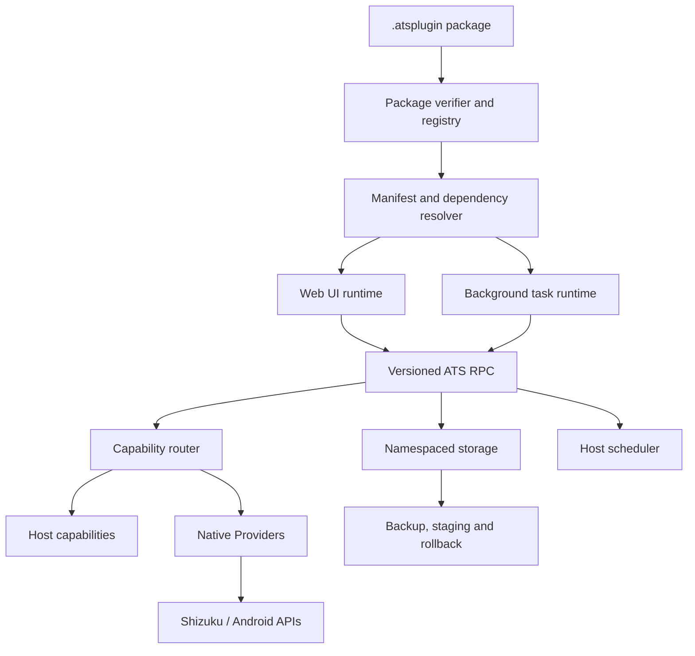

# Android Tool Suite 插件运行时重构计划

状态：方向基线
更新日期：2026-08-20
实施范围：Android-first；本计划不实现 iOS、Desktop 或其他平台宿主

## 1. 决策摘要

Android Tool Suite（ATS）的长期定位是：

> Android 上的单应用个人工具平台。普通工具以 Web 技术开发，通过一小套 ATS Capability API 使用数据、后台任务和 Android 系统能力；需要直接接触平台 API 的能力由 Native Provider 提供。

本轮方向不再继续现有的“Host APK + 通用 Sandbox APK + 远程 Compose/Surface”原型。该原型已完整保存在各仓库本地分支 `codex/runtime-v2-sandbox-archive`，作为实验记录和可复用语义的来源，不作为后续主线实现。

主线采用三层开发模型：

1. Web Tool：静态 HTML/CSS/JavaScript 即可运行，不要求 ATS 专有 API。
2. ATS Tool：Web UI + 薄 JS SDK，可选 WASM，按需调用 Capability、存储和后台任务。
3. Native Provider：使用 Kotlin/Android 实现平台能力，面向高级开发者；Shizuku 属于 Provider，而不是宿主隐藏特权入口。

WASM 是可选能力，不是普通插件的入门门槛。当前只做 Android 运行时，但清单、RPC、数据和任务接口不得暴露 `Activity`、`Context`、`Intent`、Binder 等 Android 类型，以便未来在不重写插件协议的前提下增加其他平台实现。

AI 插件开发与 ATS 发布平台不属于本计划的阶段：它们分别维护在 [ai-plugin-development-plan.md](ai-plugin-development-plan.md) 和 [publication-platform-plan.md](publication-platform-plan.md)，优先级均低于 Runtime v2。总体排序见 [product-roadmap.md](product-roadmap.md)。

## 2. 本轮目标与非目标

### 2.1 目标

- 普通插件开发退化为标准 Web 开发，加一个清单即可形成最小插件。
- 插件只学习少量稳定的 ATS API，不学习宿主 Android 生命周期和 Compose 组件树。
- UI 入口与后台入口分离；后台任务由宿主调度，不依赖常驻 WebView 或 `setInterval()`。
- Android/Shizuku 等平台能力通过版本化、类型化 Provider 契约暴露。
- 插件数据按命名空间管理，支持备份、校验、迁移、回滚与未来运行时替换。
- 保持用户只安装和打开一个 ATS App；Provider 和工具的安装细节不扩散到桌面体验。
- 保留现有签名索引、Debug/Release 渠道、依赖、升级/降级和数据兼容治理。

### 2.2 非目标

- 本计划不创建 iOS、Desktop、KMP 或 Compose Multiplatform 工程。
- 不承诺“任意语言天然可用”；准确边界是能产出 Web 资源，或能编译到 ATS 支持的 WASM ABI。
- 不把普通 Web 插件变成一个新的 UI 框架；Web 本身就是 UI SDK。
- 不在第一阶段开放不受信任的任意第三方原生代码。
- 不向普通插件提供裸 `runShellCommand()`、Binder 句柄或任意文件路径。
- 不以完成强安全沙盒为新运行时首个里程碑；先稳定协议与完整工具闭环。
- 不在 Migration Bridge 中实现新运行时的数据恢复或永久双向同步；只保留 API1 旧存储的导出与空环境回灌，用于证明 Dataset 可迁移。
- 不把 Developer Agent、AI Provider、发布社区或自托管平台作为 Runtime v2 的验收条件。

## 3. 目标架构



宿主负责验证、生命周期、路由、调度、存储、更新和统一外壳，不承载插件业务逻辑。普通插件不知道底层使用 Android WebView、Kotlin、Binder 还是 Shizuku。

## 4. 插件形态

### 4.1 Web Tool

最小包只需：

```text
manifest.json
web/index.html
web/assets/...
```

不调用 ATS API 的离线计算器、格式化器、可视化工具可以直接运行。React、Vue、Svelte、原生 Web 等均由插件自行选择，ATS 只消费构建后的静态资源。

### 4.2 ATS Tool

在 Web Tool 基础上按需增加：

- `@android-tool-suite/sdk`：薄 TypeScript/JavaScript 客户端；
- `worker.wasm`：可选的计算或后台入口；
- Capability 声明；
- 后台任务声明；
- Dataset 与数据格式声明。

复杂度随需求增加。Hello World 插件不需要理解 Provider、WASM、后台调度或 Android 构建。

### 4.3 Native Provider

Native Provider 用于无法由 Web/WASM 直接实现的 Android 能力，例如：

- `accessibility.manage`；
- `usage.query`；
- `privileged.settings`；
- 文件选择、通知和系统 Intent；
- Shizuku 连接与受控命令实现。

Provider 是显式插件类型，遵循与其他插件相同的 ID、版本、签名、依赖和发布规则；Shizuku 不获得隐藏的“官方插件”旁路。Provider 因接触平台 API 而属于受信任计算基的一部分，只有受信来源可以安装或升级。

工具应依赖业务能力，例如 `accessibility.manage`，而不是依赖具体的 `shizuku.shell`。这样未来可由 Shizuku、Root、ADB 或平台原生实现提供同一契约。

## 5. 平台无关接口边界

当前只实现 Android，但从第一版协议起保留下列接口。它们使用 JSON Schema、IDL 或 WIT 可表达的标量、记录、列表、字节流和结果类型，不出现 Android 类。

### 5.1 RuntimeHost

```text
openUi(pluginId, entryId, launchContext) -> UiSession
invokeTask(pluginId, taskId, trigger) -> TaskRun
cancel(runId) -> Result
close(sessionId) -> Result
```

Android 首版由 WebView 和宿主任务执行器实现。未来运行时可以替换引擎，插件协议不依赖 WebView API。

### 5.2 PlatformAdapter

```text
platform.id() -> string
platform.version() -> string
platform.availableCapabilities() -> CapabilityDescriptor[]
platform.openExternal(request) -> Result
```

清单首版只接受 `android` 为可执行目标，但字段使用开放字符串和能力条件；新增平台时扩展验证器与 Adapter，不修改工具业务协议。

### 5.3 CapabilityRouter

```text
resolve(capabilityId, versionRange) -> ProviderHandle
call(handle, method, payload, context) -> Result<payload, CapabilityError>
subscribe(handle, event, context) -> EventStream
```

错误至少区分：不可用、版本不兼容、用户未同意、Provider 离线、调用超时、输入无效和内部失败。普通插件不直接获得 Provider 对象或平台句柄。

### 5.4 StorageService

```text
kv.get / kv.set / kv.delete
blob.openRead / blob.openWrite / blob.delete
dataset.export / dataset.import
transaction.begin / commit / rollback
```

所有键和文件自动绑定 `pluginId + dataGeneration`。插件不能构造其他插件或宿主的物理路径。

### 5.5 SchedulerService

```text
register(taskId, triggerPolicy, constraints)
runNow(taskId, input)
cancel(taskId)
lastRun(taskId)
```

触发条件描述语义而非 Android API：周期、启动后、网络可用、充电中、应用进入前台、Provider 事件等。Android Adapter 再映射到 WorkManager、前台服务或其他合适机制。

## 6. UI Runtime

### 6.1 加载模型

- 只加载已验证插件包内的本地资源。
- 每个 UI 会话使用独立的虚拟源与数据命名空间。
- JS 与宿主通过版本化消息通道通信；不把任意宿主对象挂到 `addJavascriptInterface`。
- 导航、返回、主题、安全区和文件选择由宿主以显式事件/调用提供。
- 网络请求默认通过 Capability API；WebView 自身的任意远程导航不作为正式插件能力。
- CSP、资源大小、启动超时、内存和消息大小限制属于运行时可靠性约束，即使插件来源可信也保留。

### 6.2 主题与宿主外壳

ATS 向 Web UI 注入少量设计 token、主题状态和宿主容器尺寸，不规定 React/Vue 等框架。宿主继续负责应用级导航、插件标题、更新状态、错误外壳和无障碍最低要求；插件负责领域内容。

### 6.3 开发模式

在稳定包格式后提供 `ats dev`：

- 本地清单校验和打包；
- 生成 TypeScript 类型；
- Android Debug 宿主连接开发服务器；
- HMR、source map、控制台与模拟 Capability；
- 一条命令生成最小 Web Tool 模板。

开发服务器加载仅存在于 Debug 模式，不进入 Release 包或签名索引。

## 7. 后台 Runtime

UI WebView 不常驻后台。每个后台入口是可恢复、可超时、可重试的任务：

```text
trigger -> host scheduler -> worker entry -> capability/storage -> result
```

首版可以只支持 JavaScript worker 或受限的宿主任务协议；WASM worker 在 ABI、冷启动、内存和中断语义验证后加入。长期 ABI 可采用 WIT 风格描述并生成多语言绑定，但不在第一阶段绑定某个 WASM 引擎。

适用任务包括：

- 定期检查无障碍授权并调用 `accessibility.manage` Provider；
- 统计应用/屏幕使用；
- 定时刷新远端数据；
- 清理缓存、生成摘要和通知。

任务声明必须包含最大运行时间、重试策略、并发策略和资源约束。需要持续运行的场景由 Android Adapter 明确升级为前台服务，不能伪装成无限期普通任务。

## 8. Capability 与 Provider 规则

### 8.1 契约优先

Capability 以高层业务语义设计。示例：

```text
accessibility.listServices
accessibility.setEnabled
usage.queryRange
network.request
file.import
clipboard.read
notification.post
```

不把 `shell.exec`、任意 SQL、任意文件路径或 Binder transaction 作为普通公共 API。少数诊断场景若必须使用原始能力，应只存在于受信 Provider 开发工具中，不进入普通 Tool SDK。

### 8.2 发现与路由

- Provider 声明 `provides` 的 capability ID、版本和方法 schema。
- Tool 声明 `requires` 的版本范围与是否可选。
- 安装前解析依赖；运行时按用户选择和可用性解析 Provider。
- 同一能力允许多个 Provider，实现不得硬编码到 Tool。
- Provider 更新失败时保留上一可用版本并恢复路由。

### 8.3 授权含义

当前生态仍以可信插件为前提。Capability 声明首先用于接口治理、可见性和用户意图，不宣传为同进程下的强安全沙箱。将来若引入不可信代码或独立 UID Backend，同一声明可升级为真正的强制边界。

## 9. 包格式草案

下面只表达目标结构，不直接作为可发布 schema：

```json
{
  "format": "ats-plugin",
  "formatVersion": 3,
  "id": "com.example.text-tool",
  "version": "1.0.0",
  "platforms": ["android"],
  "runtime": {
    "ui": [{ "id": "main", "type": "web", "entry": "web/index.html" }],
    "background": []
  },
  "requires": [],
  "provides": [],
  "datasets": []
}
```

Provider 包使用同一外层模型，只在 `provides` 与平台实现入口中增加受信原生载荷。正式 schema 必须单独版本化，并配套规范化 JSON、签名覆盖范围、路径规则、大小上限、重复文件检测和兼容性测试。

## 10. 数据、备份与迁移

### 10.1 新运行时数据原则

- 默认持久数据由 StorageService 管理；缓存与持久数据分开声明。
- 凭据存入平台 SecretStore，备份时默认进入受保护区；若未来允许明文，必须像 Bridge v3 一样经过显式选择、风险提示和二次确认。
- 每个 Dataset 有稳定 ID、格式版本、依赖、敏感标记和恢复模式。
- 导入先写 staging generation，完成结构、摘要和业务校验后原子切换。
- 升级/降级根据可读写数据版本判断，不只比较插件版本号。
- 空环境恢复是备份有效性的最终证明。

### 10.2 Migration Bridge

当前 Migration Bridge 已随 1.6.1 正式版交付，使用统一 `.atsbackup` v3 在现有 v1 插件旧存储、宿主迁移状态和归档文件之间完成可验证往返：

- 同一文件可包含宿主设置／插件包与按插件选择的 Dataset，明文区和密码保护区物理分离；
- 保留流式写入、摘要、大小限制、Dataset 依赖和 AES-GCM 加密，并兼容 v2 与旧宿主迁移包导入；
- 导入先在应用私有缓存完成整包认证和完整性校验，再按依赖恢复到 v1 旧存储；
- API1 插件可声明独立 Dataset 删除，宿主展开依赖影响并按反向依赖顺序执行；
- 不安装新运行时，不写入新运行时 generation，也不承担长期双向同步；
- 早期 Debug 往返已验证格式和插件适配器，1.6.1 同包名正式版负责读取既有正式私有数据；
- 归档契约见 [data-package-v3.md](data-package-v3.md)，Dataset 清单和验收矩阵见 [migration-bridge-data-map.md](migration-bridge-data-map.md)。

Bridge 契约在完成正式数据迁移和至少一个版本的回滚窗口后删除，不演化成永久双运行时 API。

## 11. 现有 V2 原型取舍

| 原型内容 | 判定 | 后续处理 |
| --- | --- | --- |
| `.atsbackup` v3 分区编解码、完整性和加密 | 保留 | 作为 Bridge 与未来备份语义基础；继续保留 v2 只读兼容测试 |
| `LegacyDataBridge`、三插件旧数据适配器和 fixture | 保留但临时 | 支持 API1 旧存储的数据管理和正式迁移；越过回滚窗口后删除 |
| Dataset ID、格式版本、依赖、敏感标记、恢复模式 | 保留语义 | 移入平台无关 schema，不保留 Android `Activity` 接口 |
| staging generation、校验后切换、回滚思想 | 保留语义并重写 | 由 StorageService 实现，不移植原 `PluginDataManager` 代码 |
| Runtime Backend 抽象 | 保留概念 | 先实现 Web/Worker Backend；隔离进程或独立 UID 是未来可替换 Backend |
| `plugin-api` / `plugin-ui` AAR 拆分 | 重新设计 | 公共边界改为 schema/IDL + 生成绑定；Compose UI 不再是普通 Tool SDK |
| Capability Broker | 重新设计 | 从直接执行 shell/Android 调用改成类型化路由、Provider 发现和结构化错误 |
| Permission Manager | 重新设计 | 当前作为 capability 声明与用户意图；未来 Backend 再提供强制隔离 |
| `.atsplugin` v3 中硬编码 `plugin.apk`、`runtimeApi: 2` | 放弃 | 重新定义 Web Tool 与 Native Provider 载荷，不继承原字段 |
| Host + 通用 Sandbox 双 APK | 放弃 | 不继续维护第二 APK、固定 Service 列表和统一隔离 UID 方案 |
| `SurfaceControlViewHost` 远程 Compose UI | 放弃 | 普通 Tool 改用本地 Web UI；宿主只维护消息和容器边界 |
| AIDL UI 树、远程 Widget 快照和 Sandbox Bootstrap Activity | 放弃 | 由 Web UI、声明式主页摘要协议和独立后台任务重新设计 |
| 向插件暴露裸 Shell Capability | 放弃 | 只提供高层 Provider 方法 |
| 当前阶段实现 iOS/KMP Host | 放弃 | 仅保留无 Android 类型的接口和开放平台字段 |

## 12. 分阶段交付

每个阶段必须形成可安装、可回滚、可验收的完整组件，不以“新增几个字段”作为里程碑。

### 阶段 0：保存原型并验证 Bridge（已完成）

交付物：

- V2 原型归档分支；
- 宿主与三个插件的 Bridge Debug 预发布及 1.6.1 正式发布；
- 统一 `.atsbackup` v3、Dataset 清单、fixture、混合保护区和损坏包测试；
- 按插件导入／导出／删除和 v2／旧迁移包兼容入口；
- Debug 设备清空前后导入／导出与逐 Dataset 内容校验记录；正式版保留同包名旧数据读取路径。

完成情况：Debug 数据已完成代表性数据导出、空环境恢复、再次导出与逐 Dataset 比较；密码区错误密码不修改目标数据；敏感明文需要明确选择。1.6.1 将同一 Bridge 和数据管理界面作为正式版发布。

### 阶段 1：协议与包格式最小闭环

交付物：

- `manifest-v3.schema.json` 与规范文档；
- RPC envelope、错误模型、版本协商和 TypeScript 类型；
- 打包、规范化、签名和离线校验 CLI；
- 一个不使用 ATS API 的 Web Tool 示例。

退出条件：静态网页项目能被打包、签名、安装、打开和卸载；损坏包及路径穿越被拒绝。

### 阶段 2：Web Tool Runtime

交付物：

- Android Web UI Backend；
- 主题、返回、生命周期、错误外壳和资源限制；
- JS SDK 的 `app`、`storage` 和基础事件；
- 一个现有低风险工具的端到端迁移。

退出条件：新工具不依赖 Android SDK/Gradle 即可开发；冷启动、旋转、后台恢复和崩溃隔离达到基线。

### 阶段 3：Capability 与 Native Provider

交付物：

- Provider 清单、注册、版本解析、健康检查和回滚；
- 网络、文件、剪贴板等 Host Capability；
- Shizuku Provider 与首个高层能力 `accessibility.manage`；
- 调用追踪、超时和结构化错误，但不记录敏感载荷。

退出条件：无障碍工具不再调用 Host shell API；替换 Provider 不需要修改 Tool。

### 阶段 4：后台任务与可选 WASM

交付物：

- SchedulerService 和 Android Adapter；
- 周期、条件、手动和 Provider 事件触发；
- 任务超时、重试、并发和历史状态；
- 一个授权保持任务和一个使用统计任务；
- 通过验证后再加入可选 WASM Worker Backend。

退出条件：任务不依赖常驻 UI；重启、系统回收、离线和权限失效后行为可预测。

### 阶段 5：数据运行时与工具迁移

交付物：

- StorageService、SecretStore、Dataset staging/rollback；
- 空环境恢复测试；
- Phigros 与抽卡分析按工具逐一迁移；
- 使用已经发布的 1.6.1 同包名 Migration Bridge 和可回退发布方案完成旧数据导出。

退出条件：每个迁移工具都通过旧数据导出、新环境恢复、业务校验和降级演练。

### 阶段 6：开发体验与旧运行时退役

交付物：

- `npm create ats-plugin`、`ats dev`、示例和文档；
- Capability 模拟器、契约测试套件和兼容性 CI；
- 停止发布 API1 插件；
- 删除 Bridge、旧 AAR Tool API 和已确认无用的兼容代码。

退出条件：新开发者只使用 Web 工具链和 ATS API 即可完成、调试并发布普通插件。

## 13. 全局验收门槛

- 架构：普通 Tool 不引用 Android/Kotlin/Compose 类型。
- 易用性：最小插件只需静态 Web 资源与清单。
- 能力：Tool 只依赖 capability ID 和 schema，不依赖 Shizuku 实现。
- 后台：没有通过常驻 WebView 模拟后台任务的实现。
- 数据：敏感 Dataset 默认受保护，显式明文必须二次确认；导入支持 staging、校验和回滚。
- 发布：组件仓库分别测试、构建和发布，外层只锁定已验证组合。
- 兼容：现有 API1 正式版在迁移完成前持续可用。
- 平台：当前产物只有 Android；公共协议中没有 Android 类和物理路径。
- 安全表述：可信插件模型、可靠性隔离和强安全边界的能力不混为一谈。

## 14. 在编码前必须冻结的决策

阶段 1 开始前，用独立 ADR 固定以下内容：

1. Web 资源虚拟源、CSP 与远程网络策略；
2. RPC envelope、请求取消、流式数据和版本协商；
3. Provider 原生载荷的 Android 安装/加载方式及信任根；
4. 后台首版选择 JavaScript worker 还是只提供声明式宿主任务；
5. WASM 引擎评估指标与 WIT 子集，不预先绑定实现；
6. Dataset 物理存储、SecretStore、备份密钥和 staging 原子切换；
7. API1 到新运行时的退出版本、回滚窗口和 Release Bridge 发布顺序。

未冻结这些契约前，不再次并行开发 UI IPC、双 APK、权限面板和数据代管，以免重复形成一套由实现倒推出来的公共 API。
